# Folder structure

exist main with the terraform files to deploy the client and api and cockroachdb if you want to deploy the infrastructure in aws of cockroachdb

```
terraform
├── cockroachdb
│   ├── main.tf
│   ├── outputs.tf
│   ├── README.md
│   ├── template.tfvars
│   └── variables.tf
└── main
    ├── main.tf
    ├── outputs.tf
    ├── README.md
    ├── template.tfvars
    └── variables.tf

```


# Prerequisites

1. install terraform
2. install aws cli and configure the credentials, the role must have the permissions to create the cluster and the task definitions, must be can create awslogs-group and pull the images from ecr


# Deploy Client and Api


## First we set the local vars to easy the process

Replace the values with your own

``` bash
# bash
set region=us-east-1
set aws_account_id=123456789012
```

or

``` powershell
# powershell
$region = "us-east-1"
$aws_account_id = "123456789012"
```

1. Create repository

``` bash
aws ecr create-repository --repository-name stockvision-api --region $region
aws ecr create-repository --repository-name stockvision-app --region $region
```


2. Create the images with the next command and the root of the project

``` bash
docker compose up 
```


3. Tag the images

replace the values with the uri of the repository, the structure is `aws_account_id.dkr.ecr.region.amazonaws.com/repository_name:tag`

``` bash
docker tag stockvision-api:latest $aws_account_id.dkr.ecr.$region.amazonaws.com/stockvision-api:latest
docker tag stockvision-app:latest $aws_account_id.dkr.ecr.$region.amazonaws.com/stockvision-app:latest
```


4. Push the images

Get permissions to push the images with the next command, replace the values region and aws_account_id with the values of your environment

``` bash
aws ecr get-login-password --region $region | docker login --username AWS --password-stdin $aws_account_id.dkr.ecr.$region.amazonaws.com
```


After get the permissions push the images
``` bash
docker push $aws_account_id.dkr.ecr.$region.amazonaws.com/stockvision-api:latest
docker push $aws_account_id.dkr.ecr.$region.amazonaws.com/stockvision-app:latest
```


You can read more about [here](https://docs.aws.amazon.com/AmazonECR/latest/userguide/docker-push-ecr-image.html)

## Terraform Client and Api

1. Navigate to the folder main

``` bash
cd main
```

2. Copy the template.tfvars in a new file terraform.tfvars and fill the values

``` bash
# bash
cp template.tfvars terraform.tfvars
```

or

``` powershell
# powershell
copy template.tfvars terraform.tfvars
```

2. run terraform

``` bash
terraform init
terraform plan
terraform apply
```

# Cockroachdb

If you want, you can use the terraform module to create a cluster in cockroachdb

## Prerequisites

We need to get a api key from cockroachdb

You need go to [Acces Management](https://cockroachlabs.cloud/access), click the tab Service Account, then create the a new service account, then we need to make sure to have the roles to create and admin cluster in the actions options.

You can read the oficial documentation [here](https://www.cockroachlabs.com/docs/stable/cockroachcloud-get-started.html).

## Terraform

1. navigate to the folder cockroachdb

``` bash
cd cockroachdb
```

2. copy the template.tfvars in a new file terraform.tfvars and fill the values

``` bash
cp template.tfvars tfvars
terraform init
terraform apply
```

Then to view the connection string
``` bash
terraform output -raw connection_string
```


## Infrastructure Components

1. **Networking**
   - VPC with public subnets in 2 AZs (us-east-1a, us-east-1b)
   - Internet Gateway for public internet access
   - Route tables for public subnets
   - Subnet group for ElastiCache

2. **Load Balancing**
   - Application Load Balancer (ALB) with:
     - HTTP (port 80) listener
     - Target groups for API (port 8080) and App (port 80) services
     - Path-based routing (/api/* to API service)

3. **Container Orchestration**
   - ECS Cluster
   - ECS Services:
     - API Service (port 8080)
     - App Service (port 80)
   - IAM roles for ECS task execution

4. **Security**
   - ALB Security Group (allows HTTP/80 from anywhere)
   - ECS Security Group (allows traffic from ALB on ports 8080/80)
   - Redis Security Group (allows traffic from ECS on port 6379)

5. **Database**
   - External CockroachDB instance (configured via variables)

## Access Patterns
- External users access the application via the ALB
- ALB routes /api/* requests to the API service
- All other requests are routed to the App service
- API service connects to the external CockroachDB database

# AWS Infrastructure Diagram

```mermaid
graph TB
    subgraph Internet
        Users[👥 Users]
    end

    subgraph AWS["AWS Cloud - Region us-east-1"]
        subgraph VPC["VPC 10.0.0.0/16"]
            IGW[Internet Gateway]
            
            subgraph AZ1["Availability Zone A"]
                SubnetA[Public Subnet A<br/>10.0.1.0/24]
            end
            
            subgraph AZ2["Availability Zone B"]
                SubnetB[Public Subnet B<br/>10.0.2.0/24]
            end
            
            subgraph ALB_Layer["Application Load Balancer"]
                ALB[ALB<br/>stockvision-alb]
                ALB_SG[Security Group<br/>Port 80]
            end
            
            subgraph ECS["ECS Cluster - stockvision-cluster"]
                subgraph API["API Service - Fargate"]
                    API_Task[API Task<br/>512 CPU / 1024 MB<br/>Port 8080]
                    API_TG[Target Group<br/>stockvision-api-tg]
                end
                
                subgraph Client["Client Service - Fargate"]
                    Client_Task[Client Task<br/>256 CPU / 512 MB<br/>Port 80]
                    Client_TG[Target Group<br/>stockvision-app-tg]
                end
                
                ECS_SG[Security Group<br/>Ports 80, 8080]
            end
            
            subgraph Cache["ElastiCache"]
                Redis[Redis Cluster<br/>cache.t3.micro<br/>Port 6379]
                Redis_SG[Security Group<br/>Port 6379]
            end
        end
        
        subgraph External["External Services"]
            CockroachDB[(CockroachDB<br/>PostgreSQL Compatible)]
            ECR_API[ECR: API Image]
            ECR_Client[ECR: Client Image]
        end
        
        subgraph Monitoring["Monitoring"]
            CW_API[CloudWatch Logs<br/>/ecs/stockvision-api]
            CW_Client[CloudWatch Logs<br/>/ecs/stockvision-client]
        end
        
        subgraph IAM["IAM"]
            ExecRole[ECS Execution Role]
        end
    end
    
    subgraph APIs["External APIs"]
        StockAPI[Stock API]
        FinancialAPI[Financial API]
        FinhubAPI[Finhub API]
        GeminiAPI[Gemini API]
    end

    Users -->|HTTP:80| ALB
    ALB -->|"/ (default)"| Client_TG
    ALB -->|"/api/*"| API_TG
    
    Client_TG --> Client_Task
    API_TG --> API_Task
    
    Client_Task -->|API Calls| API_Task
    API_Task -->|Cache| Redis
    API_Task -->|Database| CockroachDB
    API_Task -->|External APIs| StockAPI
    API_Task --> FinancialAPI
    API_Task --> FinhubAPI
    API_Task --> GeminiAPI
    
    ECR_API -.->|Pull Image| API_Task
    ECR_Client -.->|Pull Image| Client_Task
    
    API_Task -.->|Logs| CW_API
    Client_Task -.->|Logs| CW_Client
    
    ExecRole -.->|Permissions| API_Task
    ExecRole -.->|Permissions| Client_Task
    
    IGW --> ALB
    SubnetA -.-> API_Task
    SubnetA -.-> Client_Task
    SubnetA -.-> Redis
    SubnetB -.-> API_Task
    SubnetB -.-> Client_Task
    SubnetB -.-> Redis
    
    ALB_SG -.->|Protects| ALB
    ECS_SG -.->|Protects| API_Task
    ECS_SG -.->|Protects| Client_Task
    Redis_SG -.->|Protects| Redis

    classDef aws fill:#FF9900,stroke:#232F3E,stroke-width:2px,color:#fff
    classDef compute fill:#ED7100,stroke:#232F3E,stroke-width:2px,color:#fff
    classDef network fill:#4B612C,stroke:#232F3E,stroke-width:2px,color:#fff
    classDef storage fill:#3B48CC,stroke:#232F3E,stroke-width:2px,color:#fff
    classDef external fill:#666,stroke:#333,stroke-width:2px,color:#fff
    
    class ALB,IGW network
    class API_Task,Client_Task,ECS compute
    class Redis,CockroachDB storage
    class StockAPI,FinancialAPI,FinhubAPI,GeminiAPI external
```


