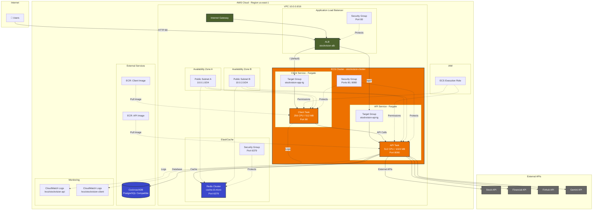

```mermaid
graph TB
    subgraph Internet
        Users[👥 Users]
    end

    subgraph AWS["AWS Cloud - Region us-east-1"]
        subgraph VPC["VPC 10.0.0.0/16"]
            IGW[Internet Gateway]
            
            subgraph AZ1["Availability Zone A"]
                SubnetA[Public Subnet A<br/>10.0.1.0/24]
            end
            
            subgraph AZ2["Availability Zone B"]
                SubnetB[Public Subnet B<br/>10.0.2.0/24]
            end
            
            subgraph ALB_Layer["Application Load Balancer"]
                ALB[ALB<br/>stockvision-alb]
                ALB_SG[Security Group<br/>Port 80]
            end
            
            subgraph ECS["ECS Cluster - stockvision-cluster"]
                subgraph API["API Service - Fargate"]
                    API_Task[API Task<br/>512 CPU / 1024 MB<br/>Port 8080]
                    API_TG[Target Group<br/>stockvision-api-tg]
                end
                
                subgraph Client["Client Service - Fargate"]
                    Client_Task[Client Task<br/>256 CPU / 512 MB<br/>Port 80]
                    Client_TG[Target Group<br/>stockvision-app-tg]
                end
                
                ECS_SG[Security Group<br/>Ports 80, 8080]
            end
            
            subgraph Cache["ElastiCache"]
                Redis[Redis Cluster<br/>cache.t3.micro<br/>Port 6379]
                Redis_SG[Security Group<br/>Port 6379]
            end
        end
        
        subgraph External["External Services"]
            CockroachDB[(CockroachDB<br/>PostgreSQL Compatible)]
            ECR_API[ECR: API Image]
            ECR_Client[ECR: Client Image]
        end
        
        subgraph Monitoring["Monitoring"]
            CW_API[CloudWatch Logs<br/>/ecs/stockvision-api]
            CW_Client[CloudWatch Logs<br/>/ecs/stockvision-client]
        end
        
        subgraph IAM["IAM"]
            ExecRole[ECS Execution Role]
        end
    end
    
    subgraph APIs["External APIs"]
        StockAPI[Stock API]
        FinancialAPI[Financial API]
        FinhubAPI[Finhub API]
        GeminiAPI[Gemini API]
    end

    Users -->|HTTP:80| ALB
    ALB -->|"/ (default)"| Client_TG
    ALB -->|"/api/*"| API_TG
    
    Client_TG --> Client_Task
    API_TG --> API_Task
    
    Client_Task -->|API Calls| API_Task
    API_Task -->|Cache| Redis
    API_Task -->|Database| CockroachDB
    API_Task -->|External APIs| StockAPI
    API_Task --> FinancialAPI
    API_Task --> FinhubAPI
    API_Task --> GeminiAPI
    
    ECR_API -.->|Pull Image| API_Task
    ECR_Client -.->|Pull Image| Client_Task
    
    API_Task -.->|Logs| CW_API
    Client_Task -.->|Logs| CW_Client
    
    ExecRole -.->|Permissions| API_Task
    ExecRole -.->|Permissions| Client_Task
    
    IGW --> ALB
    SubnetA -.-> API_Task
    SubnetA -.-> Client_Task
    SubnetA -.-> Redis
    SubnetB -.-> API_Task
    SubnetB -.-> Client_Task
    SubnetB -.-> Redis
    
    ALB_SG -.->|Protects| ALB
    ECS_SG -.->|Protects| API_Task
    ECS_SG -.->|Protects| Client_Task
    Redis_SG -.->|Protects| Redis

    classDef aws fill:#FF9900,stroke:#232F3E,stroke-width:2px,color:#fff
    classDef compute fill:#ED7100,stroke:#232F3E,stroke-width:2px,color:#fff
    classDef network fill:#4B612C,stroke:#232F3E,stroke-width:2px,color:#fff
    classDef storage fill:#3B48CC,stroke:#232F3E,stroke-width:2px,color:#fff
    classDef external fill:#666,stroke:#333,stroke-width:2px,color:#fff
    
    class ALB,IGW network
    class API_Task,Client_Task,ECS compute
    class Redis,CockroachDB storage
    class StockAPI,FinancialAPI,FinhubAPI,GeminiAPI external
```